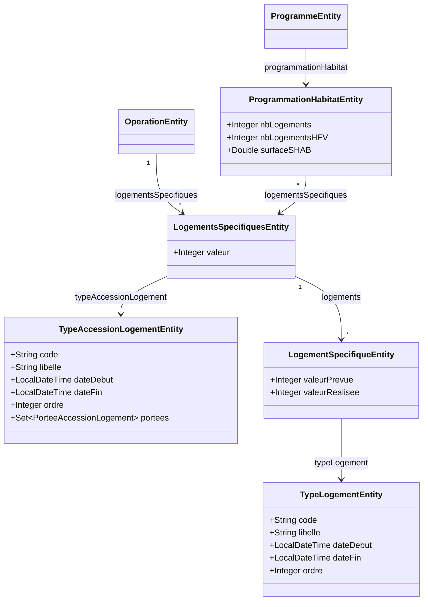
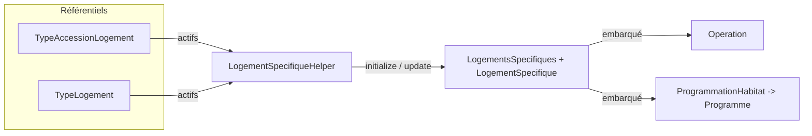

# Logements spécifiques

↩ [Modèle objet](../modele_objet.md) · 🗄️ SQL : [schema_donnees.md](../schema_donnees.md)

Sous-page **objet** du domaine des logements spécifiques : entités, rôle des champs, relations et logique applicative (
chargement / sauvegarde et initialisation automatique).

---

## 1. Présentation fonctionnelle

Un **programme** ou une **opération** décrit sa programmation logement à travers des **logements spécifiques** (
résidences étudiantes, sénior, jeunes actifs, béguinage, habitat participatif, etc.).

Les valeurs sont organisées à deux niveaux :

- **Groupe** (`LogementsSpecifiques`) : rattaché à un **type d'accession** (locatif aidé, accession aidée…).
- **Détail** (`LogementSpecifique`) : une ligne par **type de logement**, avec une valeur **prévue** et une valeur *
  *réalisée**.

Deux règles de structure selon le porteur :

| Porteur       | Organisation des groupes                                                                         |
|---------------|--------------------------------------------------------------------------------------------------|
| **Programme** | Un groupe **par type d'accession** (portée `PROGRAMME`), rattaché via la `ProgrammationHabitat`. |
| **Opération** | Un **unique groupe global**, sans type d'accession (`typeAccessionLogement = null`).             |

Les types d'accession et les types de logement sont des **référentiels** administrables (dates de validité, ordre) :
ajouter une catégorie ne demande aucun changement de code.

---

## 2. Entités JPA (`tabou2-storage`)

Le domaine repose sur cinq entités : deux **référentiels** (types d'accession et types de logement) et trois entités
**porteuses de valeurs** (groupe, détail, programmation habitat).

### `TypeAccessionLogementEntity` — référentiel des types d'accession

| Champ | Rôle |
|---|---|
| `code`, `libelle` | Identité du type d'accession (ex. `LOCATIF_AIDE` / « Locatif aidé »). |
| `dateDebut`, `dateFin` | Période de validité ; un type est **actif** si `dateDebut <= now()` et `dateFin` nulle ou future. |
| `ordre` | Ordre d'affichage. |
| `portees` | `@ElementCollection` (`EAGER`) de l'enum `PorteeAccessionLogement` : niveaux où le type s'applique (`OPERATION`, `PROGRAMME`, `SECTEUR`). |

### `TypeLogementEntity` — référentiel des types de logement

| Champ | Rôle |
|---|---|
| `code`, `libelle` | Identité du type de logement (ex. `RESID_SENIOR`). Le code `TOTAL` sert de ligne de totalisation. |
| `dateDebut`, `dateFin` | Période de validité (même règle d'activité que ci-dessus). |
| `ordre` | Ordre d'affichage des lignes de détail. |

### `LogementsSpecifiquesEntity` — groupe de logements spécifiques

| Champ | Rôle |
|---|---|
| `typeAccessionLogement` | `@ManyToOne` vers le référentiel d'accession ; `null` pour le groupe global d'une opération. |
| `valeur` | Valeur globale du groupe. |
| `logements` | `@OneToMany` (cascade `ALL`, `orphanRemoval`) : les lignes de détail du groupe. |

### `LogementSpecifiqueEntity` — détail par type de logement

| Champ | Rôle |
|---|---|
| `typeLogement` | `@ManyToOne` vers le référentiel de type de logement. |
| `valeurPrevue` | Nombre de logements prévu pour ce type. |
| `valeurRealisee` | Nombre de logements réalisé pour ce type. |

### `ProgrammationHabitatEntity` — programmation habitat d'un programme

| Champ | Rôle |
|---|---|
| `nbLogements` | Nombre total de logements du programme. |
| `nbLogementsHFV` | Logements favorables au vieillissement. |
| `surfaceSHAB` | Surface habitable totale. |
| `logementsSpecifiques` | `@ManyToMany` : groupes de logements spécifiques du programme (un par type d'accession). |

### Rattachement aux racines

- `OperationEntity.logementsSpecifiques` : `@ManyToMany` — un unique groupe global.
- `ProgrammeEntity.programmationHabitat` : `@ManyToOne` (cascade `ALL`) — la programmation habitat porte les groupes.

`PorteeAccessionLogement` est un enum à trois valeurs : `OPERATION`, `PROGRAMME`, `SECTEUR`.

---

## 3. DTO exposés (`tabou2-service`)

| DTO                     | Champs                                                                         | Usage                                |
|-------------------------|--------------------------------------------------------------------------------|--------------------------------------|
| `TypeAccessionLogement` | `id`, `code`, `libelle`, `dateDebut`, `dateFin`, `ordre`                       | Référentiel accession                |
| `TypeLogement`          | `id`, `code`, `libelle`, `dateDebut`, `dateFin`, `ordre`                       | Référentiel type de logement         |
| `LogementsSpecifiques`  | `id`, `typeAccessionLogement`, `valeur`, `logements[]`                         | Groupe                               |
| `LogementSpecifique`    | `id`, `typeLogement`, `valeurPrevue`, `valeurRealisee`                         | Ligne de détail                      |
| `ProgrammationHabitat`  | `id`, `nbLogements`, `nbLogementsHFV`, `surfaceSHAB`, `logementsSpecifiques[]` | Programmation habitat d'un programme |

**Point important :** les logements spécifiques **ne sont pas exposés par un endpoint dédié**. Ils sont **embarqués**
dans le DTO `Operation` (champ `logementsSpecifiques`) et, pour un programme, dans
`ProgrammationHabitat.logementsSpecifiques`. Ils sont donc chargés et enregistrés **en même temps** que l'opération ou
le programme. Seuls les référentiels disposent d'endpoints CRUD (§6).

---

## 4. Cycle de vie côté code

Toute la logique CRUD des groupes et de leurs détails est centralisée dans **`LogementSpecifiqueHelper`** (
`tabou2-service`, package `service.helper.logement`), utilisé à la fois par les opérations et les programmes.

### 4.1 Initialisation automatique

Méthode `initializeLogementsSpecifiques(PorteeAccessionLogement portee, List<LogementsSpecifiquesEntity> targetList)`.

Elle crée la structure vide (valeurs à `null`) à partir des référentiels **actifs** :

1. Charge les `TypeAccessionLogementEntity` actifs de la **portée** demandée.
2. Charge les `TypeLogementEntity` actifs.
3. Pour chaque type d'accession, crée un groupe contenant une ligne de détail par type de logement.

Un référentiel est **actif** lorsque `dateDebut <= now()` et (`dateFin` est `null` ou `dateFin > now()`).

Cette initialisation est déclenchée **à la création**, uniquement si aucun logement spécifique n'est déjà fourni :

- `OperationServiceImpl` : appelle `initializeLogementsSpecifiques(PorteeAccessionLogement.OPERATION, …)` quand
  `operationEntity.getLogementsSpecifiques()` est vide. L'opération obtient donc **un seul groupe global** par type
  d'accession de portée `OPERATION`.
- `ProgrammeServiceImpl` : via `initializeLogementsSpecifiquesIfNeeded(...)`, appelle
  `initializeLogementsSpecifiques(PorteeAccessionLogement.PROGRAMME, …)` pour peupler la `ProgrammationHabitat` du
  programme.

La portée `SECTEUR` existe dans l'enum mais n'est pas utilisée à l'initialisation : un secteur est une opération (
`estSecteur = true`) et suit donc la portée `OPERATION`.

### 4.2 Mise à jour

Méthode `updateLogementsSpecifiques(List<LogementsSpecifiques> dtos, List<LogementsSpecifiquesEntity> actualList)`. Elle
réconcilie la liste reçue avec l'existant :

- `dtos == null` → aucune modification.
- `dtos` vide → suppression de tous les groupes existants.
- sinon, par différence sur les `id` :
    - **suppression** des groupes absents de la liste reçue ;
    - **mise à jour** des groupes existants (valeur, type d'accession, et récursivement les détails) ;
    - **ajout** des nouveaux groupes et de leurs détails.

Les détails (`LogementSpecifiqueEntity`) sont réconciliés de la même façon (suppression / mise à jour de `valeurPrevue`·
`valeurRealisee` / ajout). Les points d'entrée applicatifs sont :

- `OperationUpdateHelper.updateLogementsSpecifiques(...)` lors de la sauvegarde d'une opération ;
- `ProgrammeServiceImpl.updateLogementsSpecifiques(...)` lors de la sauvegarde d'un programme (sur la
  `ProgrammationHabitat`).

---

## 5. Résumé du flux

À la **création**, le helper initialise la structure vide à partir des référentiels actifs. À la **sauvegarde**, le
helper applique les valeurs saisies. Les données transitent toujours **dans** l'opération ou le programme, jamais par un
endpoint propre.

---

## 6. Endpoints des référentiels

Seuls les **référentiels** disposent d'API dédiées (services `TypeAccessionLogementService` / `TypeLogementService`) :

| Méthode | URL                                         | Description                             |
|---------|---------------------------------------------|-----------------------------------------|
| `GET`   | `/types-accession-logement`                 | Recherche paginée des types d'accession |
| `GET`   | `/types-accession-logement/{id}`            | Détail d'un type d'accession            |
| `POST`  | `/types-accession-logement`                 | Création                                |
| `PUT`   | `/types-accession-logement/{id}`            | Mise à jour                             |
| `PUT`   | `/types-accession-logement/{id}/inactivate` | Inactivation (positionne `dateFin`)     |
| `GET`   | `/types-logement`                           | Recherche paginée des types de logement |
| `GET`   | `/types-logement/{id}`                      | Détail d'un type de logement            |
| `POST`  | `/types-logement`                           | Création                                |
| `PUT`   | `/types-logement/{id}`                      | Mise à jour                             |
| `PUT`   | `/types-logement/{id}/inactivate`           | Inactivation                            |

Paramètres de recherche communs : `libelle` (partiel), `inactif` (défaut `false`), `start` / `resultsNumber` (
pagination), `orderBy` / `asc` (tri, défaut `ordre` ascendant).
