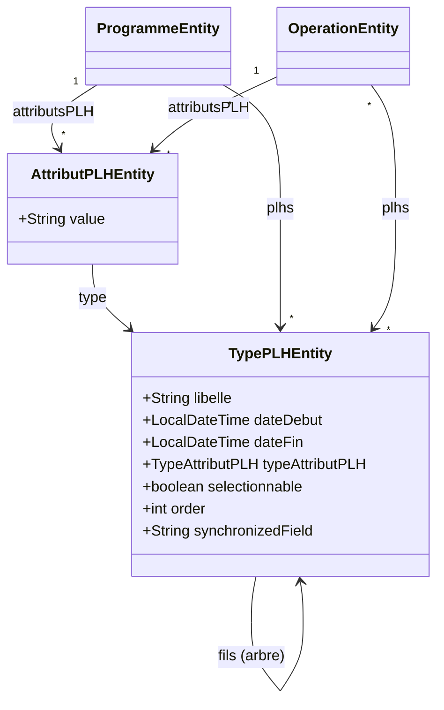

# Suivi PLH (Programme Local de l'Habitat)

↩ [Modèle objet](../modele_objet.md) · 🗄️ SQL : [schema_donnees.md](../schema_donnees.md)

Sous-page **objet** du domaine du suivi PLH : entités, rôle des champs, arborescence, logique de chargement /
sauvegarde et synchronisation avec l'opération.

---

## 1. Présentation fonctionnelle

Le **suivi PLH** rattache à un **programme** ou une **opération** un ou plusieurs **types de PLH** organisés en *
*arborescence**. Chaque nœud de l'arbre est soit :

- une **catégorie** (`CATEGORY`) : simple regroupement, sans valeur saisissable ;
- une **valeur** (`VALUE`) : nœud portant une donnée saisie par l'utilisateur.

L'arbre des types (`TypePLH`) est un **référentiel** administrable (dates de validité, ordre, caractère
sélectionnable) : sa structure évolue sans changement de code. Les valeurs saisies sont stockées séparément dans des *
*attributs PLH** (`AttributPLH`) propres à chaque programme / opération.

Un type PLH peut être **synchronisé** avec un champ de l'opération (champ `synchronizedField`) : la valeur saisie dans
le PLH est alors reportée automatiquement sur l'opération, et inversement.

⚠ La classe `PlhEntity` / table `tabou_plh` (logements prévus / livrés) est un objet **distinct** du suivi PLH décrit
ici ; elle n'en fait pas partie.

---

## 2. Entités JPA (`tabou2-storage`)

Le domaine repose sur deux entités : le **type de PLH** (structure arborescente, référentiel) et l'**attribut PLH** (
valeur saisie). Elles sont rattachées aux racines `OperationEntity` et `ProgrammeEntity`.

### `TypePLHEntity` — nœud de l'arbre des types de PLH

| Champ | Rôle |
|---|---|
| `libelle` | Libellé affiché du nœud. |
| `dateDebut`, `dateFin` | Période de validité du nœud dans le référentiel. |
| `typeAttributPLH` | Enum `CATEGORY` (regroupement, non saisissable) ou `VALUE` (nœud portant une valeur). |
| `fils` | `@OneToMany` **réflexif** (cascade `ALL`) sur le parent : constitue l'arborescence. |
| `selectionnable` | Indique si le nœud peut être sélectionné dans l'IHM. |
| `order` | Ordre d'affichage entre nœuds frères. |
| `synchronizedField` | Nom d'un champ de `OperationEntity` à synchroniser avec la valeur du nœud (cf. §5). Reste interne. |

### `AttributPLHEntity` — valeur saisie pour un nœud `VALUE`

| Champ | Rôle |
|---|---|
| `value` | Valeur saisie par l'utilisateur pour le type PLH associé. |
| `type` | `@ManyToOne` vers le `TypePLHEntity` (nœud `VALUE`) auquel la valeur se rapporte. |

### Rattachement aux racines

`OperationEntity` et `ProgrammeEntity` portent les deux mêmes collections :

- `plhs` : `@ManyToMany` vers `TypePLHEntity` — les types de PLH rattachés.
- `attributsPLH` : `@OneToMany` (cascade `ALL`, `orphanRemoval`) vers `AttributPLHEntity` — les valeurs saisies.

`TypeAttributPLH` est un enum à deux valeurs : `CATEGORY`, `VALUE`.

---

## 3. DTO exposés (`tabou2-service`)

| DTO           | Champs                                                                                                                  | Usage                                          |
|---------------|-------------------------------------------------------------------------------------------------------------------------|------------------------------------------------|
| `TypePLH`     | `id`, `libelle`, `dateDebut`, `dateFin`, `typeAttributPLH`, **`value`**, `fils[]` (récursif), `selectionnable`, `order` | Arbre complet avec ses valeurs                 |
| `TypePLHBean` | `id`, `libelle`                                                                                                         | Version allégée (liste des PLH d'un programme) |

**Point important :** le DTO `TypePLH` **aplatit** la valeur de l'`AttributPLHEntity` correspondante dans son champ
`value`. Côté client, il n'y a donc **pas** d'objet « attribut » distinct : chaque nœud `VALUE` porte directement sa
valeur. Le champ `synchronizedField` reste **interne** et n'est pas exposé.

---

## 4. Arborescence et valeurs

- La structure de l'arbre est portée par `TypePLHEntity.fils` (relation réflexive). Un rendu ou un traitement se fait
  par **récursion** sur `fils`.
- Seuls les nœuds `VALUE` portent une donnée saisie ; les nœuds `CATEGORY` ne servent qu'au regroupement.
- La valeur d'un nœud `VALUE` est stockée dans un `AttributPLHEntity` (`value`) relié au `TypePLHEntity`. Le
  rattachement au programme / à l'opération passe par les collections `attributsPLH`.

---

## 5. Synchronisation PLH ↔ Opération

Gérée par **`PLHSynchronizationHelper`** (`tabou2-service`, package `service.helper.plh`). Pour chaque nœud dont
`synchronizedField` est renseigné, la synchronisation est **récursive** sur les `fils` et fonctionne dans les deux
sens :

- `synchronizePLHToOperation(typePLH, operation)` : la `value` de l'attribut PLH est convertie vers le type cible puis *
  *reportée sur le champ de l'opération** via introspection (recherche du setter, `setAccessible` car les accesseurs
  Lombok sont package-private).
- `synchronizeOperationToPLH(typePLH, operation)` : la valeur du champ de l'opération est lue (getter / isXxx) et *
  *recopiée dans l'attribut PLH** correspondant.

Types supportés pour la conversion : `String`, `Integer`/`int`, `Long`/`long`, `Double`/`double`, `Boolean`/`boolean`,
`LocalDateTime`, `LocalDate`, `Instant`. En cas d'erreur de parsing, la valeur est mise à `null` (pas de propagation
d'exception). Un setter/getter introuvable ou un type non supporté est simplement journalisé.

`OperationServiceImpl` invoque `synchronizePLHToOperation(...)` lors du traitement des PLH d'une opération afin de
reporter les valeurs saisies sur les champs de l'opération.

---

## 6. Endpoints

### 6.1 Référentiel des types PLH

| Méthode  | URL                                           | Description                                     |
|----------|-----------------------------------------------|-------------------------------------------------|
| `GET`    | `/type-plh?programmeId={id}&operationId={id}` | Types PLH **disponibles** (non encore associés) |
| `GET`    | `/type-plh/{id}`                              | Détail d'un type PLH                            |
| `PUT`    | `/type-plh`                                   | Mise à jour d'un type PLH                       |
| `POST`   | `/type-plh/{idParent}`                        | Ajout d'un type PLH enfant sous un parent       |
| `DELETE` | `/type-plh/{id}`                              | Suppression d'un type PLH                       |
| `GET`    | `/type-plh/{id}/searchParent`                 | Recherche du parent d'un type PLH               |

### 6.2 PLH d'un programme

| Méthode  | URL                                | Description                          |
|----------|------------------------------------|--------------------------------------|
| `POST`   | `/programmes/{id}/plh/{idTypePLH}` | Rattacher un type PLH                |
| `GET`    | `/programmes/{id}/plh/{idTypePLH}` | Récupérer l'arbre PLH (avec valeurs) |
| `PUT`    | `/programmes/{id}/plh`             | Mettre à jour les valeurs de l'arbre |
| `DELETE` | `/programmes/{id}/plh/{idTypePLH}` | Détacher un type PLH                 |

La liste des PLH d'un programme est portée par le champ `typePLHsBeans` de l'objet `Programme` (liste de
`TypePLHBean`).

### 6.3 PLH d'une opération

| Méthode  | URL                                | Description                          |
|----------|------------------------------------|--------------------------------------|
| `GET`    | `/operations/{id}/plhs`            | Liste des types PLH associés         |
| `POST`   | `/operations/{id}/plh/{idTypePLH}` | Rattacher un type PLH                |
| `GET`    | `/operations/{id}/plh/{idTypePLH}` | Récupérer l'arbre PLH (avec valeurs) |
| `PUT`    | `/operations/{id}/plh/{idTypePLH}` | Mettre à jour les valeurs de l'arbre |
| `DELETE` | `/operations/{id}/plh/{idTypePLH}` | Détacher un type PLH                 |
