# Modèle objet

Point d'entrée **orienté objet** de la documentation Tabou. Il présente le modèle métier tel qu'il est implémenté dans les entités JPA (`tabou2-storage`), indépendamment de sa traduction en base.

- Pour le détail relationnel (tables, colonnes, contraintes SQL), voir [schema_donnees.md](schema_donnees.md).
- Pour le détail d'un domaine, suivre les liens de la section **Domaines métier** (§3).

---

## 1. Entités racines

Le modèle s'articule autour de deux **entités racines** (agrégats) qui portent la quasi-totalité des données métier :

| Entité | Rôle |
|---|---|
| `OperationEntity` | Une **opération** d'aménagement (ou un **secteur** si `secteur = true`). Racine qui agrège l'étape, la gouvernance, le foncier, la programmation, les événements et les programmes qui la composent. |
| `ProgrammeEntity` | Un **programme** immobilier rattaché à une opération. Porte la programmation logement (dont la programmation habitat) et son propre suivi. |

Une opération contient **plusieurs programmes** (`OperationEntity.programmes`), et chaque programme référence son opération (`ProgrammeEntity.operation`). Une opération peut aussi être **hiérarchique** via `parent`.

### Champs structurants

**`OperationEntity`**

| Champ | Rôle |
|---|---|
| `code`, `nom`, `operation`, `description` | Identité de l'opération. |
| `secteur` | `true` si l'opération est en réalité un **secteur** (regroupement géographique). |
| `parent` | Opération parente (arborescence des opérations). |
| `diffusionRestreinte` | Restreint la visibilité de l'opération. |
| `autorisationDate`, `operationnelDate`, `livraisonDate`, `clotureDate`, `annulationDate` | Jalons du cycle de vie. |
| `surfaceTotale`, `surfaceRealisee`, `nbLogementsPrevu`, `nbLogementsHFV` | Indicateurs de programmation. |

**`ProgrammeEntity`**

| Champ | Rôle |
|---|---|
| `code`, `nom`, `programme`, `description` | Identité du programme. |
| `nbLogements`, `logements*Prevu`, `nbLogementsHFV`, `surfaceSHAB` | Programmation logement historique (portée aujourd'hui par la programmation habitat, cf. sous-page dédiée). |
| `attributionDate`, `commercialisationDate`, `dateLivraison`, `clotureDate` | Jalons du cycle de vie. |
| `prixLogtsLibres*`, `prixTerrainBatir*` | Indicateurs de prix. |

---

## 2. Diagramme de classes global

Le diagramme regroupe, pour chaque racine, ses associations principales. Les référentiels simples (`@ManyToOne` vers un libellé) sont regroupés visuellement ; les collections (`@OneToMany` / `@ManyToMany`) sont marquées `*`.

```mermaid
classDiagram
    class OperationEntity {
        +String code
        +String nom
        +Boolean secteur
        +LocalDateTime livraisonDate
        +Double surfaceTotale
        +Integer nbLogementsPrevu
    }
    class ProgrammeEntity {
        +String code
        +String nom
        +int nbLogements
        +Double surfaceSHAB
    }

    OperationEntity --> OperationEntity : parent
    OperationEntity "1" --> "*" ProgrammeEntity : programmes
    ProgrammeEntity --> OperationEntity : operation

    %% Étapes & événements
    OperationEntity --> EtapeOperationEntity : etapeOperation
    OperationEntity "1" --> "*" EvenementOperationEntity : evenements
    ProgrammeEntity --> EtapeProgrammeEntity : etapeProgramme
    ProgrammeEntity "1" --> "*" EvenementProgrammeEntity : evenements

    %% Qualification (référentiels)
    OperationEntity --> NatureEntity : nature
    OperationEntity --> VocationEntity : vocation
    OperationEntity --> VocationZAEntity : vocationZa
    OperationEntity --> TypeOccupationEntity : typeOccupation
    OperationEntity --> DecisionEntity : decision
    OperationEntity --> ConsommationEspaceEntity : consommationEspace

    %% Aménagement & foncier
    OperationEntity --> MaitriseOuvrageEntity : maitriseOuvrage
    OperationEntity --> ModeAmenagementEntity : modeAmenagement
    OperationEntity --> OutilAmenagementEntity : outilAmenagement
    OperationEntity --> OutilFoncierEntity : outilFoncier
    OperationEntity "1" --> "*" AmenageurEntity : amenageurs
    OperationEntity "1" --> "*" DescriptionFoncierEntity : descriptionsFoncier

    %% Gouvernance & acteurs
    OperationEntity --> EntiteReferenteEntity : entiteReferente
    OperationEntity "1" --> "*" OperationTiersEntity : operationsTiers
    OperationEntity "1" --> "*" ActeurEntity : acteurs
    OperationEntity --> DescriptionConcertationEntity : concertation

    %% Financement & suivi
    OperationEntity "1" --> "*" DescriptionFinancementOperationEntity : financements
    OperationEntity "1" --> "*" ContributionEntity : contributions
    OperationEntity "1" --> "*" ActionOperationEntity : actions
    OperationEntity "1" --> "*" InformationProgrammationEntity : informationsProgrammation

    %% Projet urbain (partagé)
    OperationEntity --> ProjetUrbainEntity : projetUrbain
    ProgrammeEntity --> ProjetUrbainEntity : projetUrbain
    ProgrammeEntity --> ProgrammationEntity : programmation

    %% Habitat / logements spécifiques
    OperationEntity "1" --> "*" LogementsSpecifiquesEntity : logementsSpecifiques
    ProgrammeEntity --> ProgrammationHabitatEntity : programmationHabitat
    ProgrammationHabitatEntity "1" --> "*" LogementsSpecifiquesEntity : logementsSpecifiques

    %% Suivi PLH
    OperationEntity "1" --> "*" TypePLHEntity : plhs
    OperationEntity "1" --> "*" AttributPLHEntity : attributsPLH
    ProgrammeEntity "1" --> "*" TypePLHEntity : plhs
    ProgrammeEntity "1" --> "*" AttributPLHEntity : attributsPLH
    OperationEntity --> PlhEntity : plh
```

> `OperationEntity.plh` (`PlhEntity`) porte les logements prévus / livrés PLH historiques ; à ne pas confondre avec le **suivi PLH** arborescent (`TypePLHEntity` / `AttributPLHEntity`), décrit dans sa sous-page.

---

## 3. Domaines métier

Chaque domaine dispose d'une sous-page orientée objet (entités, rôle des champs, diagramme détaillé) :

| Domaine | Sous-page | Contenu |
|---|---|---|
| 🏠 Logements spécifiques & programmation habitat | [fonctionnalites/logements_specifiques.md](fonctionnalites/logements_specifiques.md) | Groupes de logements par type d'accession, détail par type de logement, initialisation et sauvegarde. |
| 🏘️ Suivi PLH | [fonctionnalites/plh.md](fonctionnalites/plh.md) | Arbre des types de PLH, valeurs saisies, synchronisation avec l'opération. |

---

## 4. Correspondance avec la base

Le mapping objet → relationnel (nom des tables, colonnes, contraintes, données de référence) est documenté dans [schema_donnees.md](schema_donnees.md). Chaque sous-page renvoie vers la section SQL correspondante.
