# Schéma de données (SQL)

Cette documentation décrit le schéma relationnel de l'application Tabou : bases de données, tables et colonnes.

Pour le modèle métier (entités objet et leurs relations), voir [modele_objet.md](modele_objet.md).

## Base de données Tabou

La base de données Tabou a vocation à héberger les données métiers du plugin. Il n'y a pas de schéma spécifique, il doit
être défini dans le search_path de l'utilisateur.

### Properties

- spring.tabou2.datasource.jdbc-url
- spring.tabou2.datasource.username
- spring.tabou2.datasource.password

### Tables

- tabou_action_operation
- tabou_acteur
- tabou_agapeo
- tabou_amenageur
- tabou_attribut_plh
- tabou_consommation_espace
- tabou_contact_tiers
- tabou_contribution
- tabou_decision
- tabou_description_concertation
- tabou_description_financement_operation
- tabou_description_foncier
- tabou_entite_referente
- tabou_etape_operation
- tabou_etape_programme
- tabou_evenement_operation
- tabou_evenement_programme
- tabou_fonction_contact
- tabou_information_programmation
- tabou_logement_specifique
- tabou_logements_specifiques
- tabou_maitrise_ouvrage
- tabou_mode_amenagement
- tabou_mos
- tabou_nature
- tabou_operation
- tabou_operation_attribut_plh
- tabou_operation_logements_sp
- tabou_operation_tiers
- tabou_operation_type_plh
- tabou_outil_amenagement
- tabou_outil_foncier
- tabou_pc_ddc
- tabou_plh
- tabou_prog_habitat_logements_sp
- tabou_programmation_habitat
- tabou_programme
- tabou_programme_attribut_plh
- tabou_programme_tiers
- tabou_programme_type_plh
- tabou_projet_urbain
- tabou_tiers
- tabou_type_accession_logement
- tabou_type_accession_logement_portee
- tabou_type_action_operation
- tabou_type_acteur
- tabou_type_amenageur
- tabou_type_contribution
- tabou_type_document
- tabou_type_evenement
- tabou_type_financement
- tabou_type_financement_operation
- tabou_type_foncier
- tabou_type_logement
- tabou_type_occupation
- tabou_type_plh
- tabou_type_programmation
- tabou_type_tiers
- tabou_vocation
- tabou_vocation_za
- v_oa_operation
- v_oa_secteur

### Diagramme relationnel

Vue d'ensemble des relations de la base Tabou (clés étrangères). Les tables de référentiel (`tabou_type_*`, natures,
étapes, etc.) pointent vers les entités qu'elles qualifient ; `tabou_operation` et `tabou_programme` sont les tables
centrales. Les tables `tabou_agapeo`, `tabou_mos`, `tabou_pc_ddc`, `tabou_type_document` et `tabou_type_financement`
n'ont pas de clé étrangère et ne figurent pas dans le diagramme ; les vues `v_oa_operation` / `v_oa_secteur` en sont
également exclues.

```mermaid
erDiagram
    %% Opération et hiérarchie
    tabou_operation ||--o{ tabou_operation : "id_parent"
    tabou_operation ||--o{ tabou_programme : ""
    tabou_etape_programme ||--o{ tabou_programme : ""

    %% Qualification de l'opération (référentiels)
    tabou_nature ||--o{ tabou_operation : ""
    tabou_vocation ||--o{ tabou_operation : ""
    tabou_vocation_za ||--o{ tabou_operation : ""
    tabou_decision ||--o{ tabou_operation : ""
    tabou_type_occupation ||--o{ tabou_operation : ""
    tabou_consommation_espace ||--o{ tabou_operation : ""
    tabou_etape_operation ||--o{ tabou_operation : ""
    tabou_entite_referente ||--o{ tabou_operation : ""
    tabou_plh ||--o{ tabou_operation : ""

    %% Aménagement & foncier
    tabou_maitrise_ouvrage ||--o{ tabou_operation : ""
    tabou_mode_amenagement ||--o{ tabou_operation : ""
    tabou_outil_amenagement ||--o{ tabou_operation : ""
    tabou_outil_foncier ||--o{ tabou_operation : ""
    tabou_description_concertation ||--o{ tabou_operation : ""
    tabou_type_foncier ||--o{ tabou_description_foncier : ""
    tabou_operation ||--o{ tabou_description_foncier : ""
    tabou_type_amenageur ||--o{ tabou_amenageur : ""
    tabou_operation ||--o{ tabou_amenageur : ""

    %% Projet urbain (partagé)
    tabou_projet_urbain ||--o{ tabou_operation : ""
    tabou_projet_urbain ||--o{ tabou_programme : ""

    %% Événements & étapes (workflow)
    tabou_operation ||--o{ tabou_evenement_operation : ""
    tabou_type_evenement ||--o{ tabou_evenement_operation : ""
    tabou_programme ||--o{ tabou_evenement_programme : ""
    tabou_type_evenement ||--o{ tabou_evenement_programme : ""
    tabou_etape_operation ||--o{ tabou_etape_operation_workflow : ""
    tabou_etape_programme ||--o{ tabou_etape_programme_workflow : ""

    %% Gouvernance & tiers
    tabou_operation ||--o{ tabou_operation_tiers : ""
    tabou_programme ||--o{ tabou_programme_tiers : ""
    tabou_tiers ||--o{ tabou_operation_tiers : ""
    tabou_tiers ||--o{ tabou_programme_tiers : ""
    tabou_type_tiers ||--o{ tabou_operation_tiers : ""
    tabou_type_tiers ||--o{ tabou_programme_tiers : ""
    tabou_tiers ||--o{ tabou_contact_tiers : ""
    tabou_fonction_contact ||--o{ tabou_contact_tiers : ""

    %% Suivi opérationnel
    tabou_type_programmation ||--o{ tabou_information_programmation : ""
    tabou_operation ||--o{ tabou_information_programmation : ""
    tabou_type_contribution ||--o{ tabou_contribution : ""
    tabou_operation ||--o{ tabou_contribution : ""
    tabou_type_action_operation ||--o{ tabou_action_operation : ""
    tabou_operation ||--o{ tabou_action_operation : ""
    tabou_type_acteur ||--o{ tabou_acteur : ""
    tabou_operation ||--o{ tabou_acteur : ""
    tabou_type_financement_operation ||--o{ tabou_description_financement_operation : ""
    tabou_operation ||--o{ tabou_description_financement_operation : ""

    %% Habitat & logements spécifiques
    tabou_programmation_habitat ||--o| tabou_programme : ""
    tabou_type_accession_logement ||--o{ tabou_type_accession_logement_portee : ""
    tabou_type_accession_logement ||--o{ tabou_logements_specifiques : ""
    tabou_logements_specifiques ||--o{ tabou_logement_specifique : ""
    tabou_type_logement ||--o{ tabou_logement_specifique : ""
    tabou_programmation_habitat ||--o{ tabou_prog_habitat_logements_sp : ""
    tabou_logements_specifiques ||--o{ tabou_prog_habitat_logements_sp : ""
    tabou_operation ||--o{ tabou_operation_logements_sp : ""
    tabou_logements_specifiques ||--o{ tabou_operation_logements_sp : ""

    %% Suivi PLH
    tabou_type_plh ||--o{ tabou_type_plh : "id_type_plh_parent"
    tabou_type_plh ||--o{ tabou_attribut_plh : ""
    tabou_operation ||--o{ tabou_operation_type_plh : ""
    tabou_type_plh ||--o{ tabou_operation_type_plh : ""
    tabou_programme ||--o{ tabou_programme_type_plh : ""
    tabou_type_plh ||--o{ tabou_programme_type_plh : ""
    tabou_operation ||--o{ tabou_operation_attribut_plh : ""
    tabou_attribut_plh ||--o{ tabou_operation_attribut_plh : ""
    tabou_programme ||--o{ tabou_programme_attribut_plh : ""
    tabou_attribut_plh ||--o{ tabou_programme_attribut_plh : ""
```



## Base de données SIG

La base de données SIG a vocation à fournir des informations externes à l'application mais nécessaires à son
fonctionnement.
Des schémas spécifiques sont attendus par rapport à la connaissance de l'existant des bases RM. Il est prévu de retirer
cette adhérence à l'occasion de la V2.

### Properties

- spring.sig.datasource.jdbc-url
- spring.sig.datasource.username
- spring.sig.datasource.password

### Schémas

#### demographie

| Table | Colonnes attendues                                                       | R/W  |
|:-----:|:-------------------------------------------------------------------------|:----:|
| iris  | <ul><li>objectid</li><li>ccom</li><li>code_iris</li><li>nmiris</li></ul> | Read |

#### economie

| Table | Colonnes attendues                                        |  R/W  |
|:-----:|:----------------------------------------------------------|:-----:|
|  za   | <ul><li>objectid</li><li>id_tabou</li><li>nomZa</li></ul> | Write |

#### limite_admin

|      Table      | Colonnes attendues                                                              | R/W  |
|:---------------:|:--------------------------------------------------------------------------------|:----:|
| comite_sect_tab | <ul><li>num_secteur</li><li>nom_secteur</li></ul>                               | Read |
| commune_emprise | <ul><li>objectid</li><li>nom</li><li>code_insee</li><li>commune_agglo</li></ul> | Read |
|    quartier     | <ul><li>objectid</li><li>nom</li><li>nuquart</li><li>code_insee</li></ul>       | Read |

#### urba_foncier

|           Table            | Colonnes attendues                                                     |  R/W  |
|:--------------------------:|:-----------------------------------------------------------------------|:-----:|
|   oa_limite_intervention   | <ul><li>objectid</li><li>id_tabou</li><li>nom</li><li>nature</li></ul> | Write |
|       plui_zone_urba       | <ul><li>objectid</li><li>libelle</li></ul>                             | Read  |
|        oa_programme        | <ul><li>objectid</li><li>programme</li><li>id_tabou</li></ul>          | Write |
|    instructeur_secteur     | <ul><li>id</li><li>secteur</li></ul>                                   | Read  |
|         oa_secteur         | <ul><li>objectid</li><li>id_tabou</li><li>secteur</li></ul>            | Write |
| negociateurfoncier_secteur | <ul><li>objectid</li><li>negociateur</li></ul>                         | Read  |
|  chargedoperation_secteur  | <ul><li>id</li><li>nom_secteur</li></ul>                               | Read  |
|            zac             | <ul><li>id_zac</li><li>id_tabou</li><li>nomZac</li></ul>               | Write |

## Logements spécifiques

Un **programme** ou une **opération** porte des logements spécifiques regroupés par **type d'accession** et déclinés par
**type de logement** (valeurs prévue / réalisée). Deux référentiels (`tabou_type_accession_logement`,
`tabou_type_logement`) pilotent la structure ; les valeurs saisies sont stockées dans `tabou_logements_specifiques` /
`tabou_logement_specifique`.

### `tabou_type_accession_logement` — référentiel des types d'accession

| Colonne                      | Type             | Description                      |
|------------------------------|------------------|----------------------------------|
| `id_type_accession_logement` | `bigserial` (PK) | Identifiant                      |
| `code`                       | `varchar(30)`    | Code technique                   |
| `libelle`                    | `varchar(100)`   | Libellé affiché                  |
| `date_debut`                 | `timestamp`      | Début de validité                |
| `date_fin`                   | `timestamp`      | Fin de validité (`NULL` = actif) |
| `ordre`                      | `integer`        | Ordre d'affichage                |

Données de référence :

```sql
INSERT INTO tabou_type_accession_logement (code, libelle, ordre, date_debut, date_fin)
VALUES ('ACCESS_AIDE', 'Accession aidée', 1, TIMESTAMP '2026-01-01 00:00:00', NULL),
       ('ACCESS_LIBRE', 'Accession libre', 2, TIMESTAMP '2026-01-01 00:00:00', NULL),
       ('ACCESS_MAITRISE', 'Accession maîtrisée', 3, TIMESTAMP '2026-01-01 00:00:00', NULL),
       ('LOCATIF_AIDE', 'Locatif aidé', 4, TIMESTAMP '2026-01-01 00:00:00', NULL),
       ('LOCATIF_REG_HLM', 'Locatif régulé HLM', 5, TIMESTAMP '2026-01-01 00:00:00', NULL),
       ('LOCATIF_REG_PRIVE', 'Locatif régulé privé', 6, TIMESTAMP '2026-01-01 00:00:00', NULL);
```

### `tabou_type_accession_logement_portee` — portées d'un type d'accession

| Colonne                      | Type          | Description                                                |
|------------------------------|---------------|------------------------------------------------------------|
| `id_type_accession_logement` | `bigint` (FK) | Type d'accession concerné                                  |
| `portee`                     | `varchar(20)` | `OPERATION`, `PROGRAMME` ou `SECTEUR` (contrainte `CHECK`) |

Chaque type d'accession est initialisé avec les portées `PROGRAMME` **et** `OPERATION`.

### `tabou_type_logement` — référentiel des types de logement

| Colonne            | Type             | Description                                                      |
|--------------------|------------------|------------------------------------------------------------------|
| `id_type_logement` | `bigserial` (PK) | Identifiant                                                      |
| `code`             | `varchar(30)`    | Code technique                                                   |
| `libelle`          | `varchar(100)`   | Libellé affiché                                                  |
| `date_debut`       | `timestamp`      | Début de validité                                                |
| `date_fin`         | `timestamp`      | Fin de validité (`NULL` = actif)                                 |
| `ordre`            | `integer`        | Ordre d'affichage (le type `TOTAL` en tête sert de totalisation) |

Données de référence :

```sql
INSERT INTO tabou_type_logement (code, libelle, ordre, date_debut, date_fin)
VALUES ('TOTAL', 'Logts spécifiques (total)', 1, TIMESTAMP '2026-01-01 00:00:00', NULL),
       ('RESID_JEUNES_ACTIFS', 'Résid. jeunes actifs', 2, TIMESTAMP '2026-01-01 00:00:00', NULL),
       ('RESID_ETUDIANTE', 'Résid. étudiante', 3, TIMESTAMP '2026-01-01 00:00:00', NULL),
       ('RESID_SENIOR', 'Résid. sénior', 4, TIMESTAMP '2026-01-01 00:00:00', NULL),
       ('HABITAT_PARTICIPATIF', 'Habitat participatif', 5, TIMESTAMP '2026-01-01 00:00:00', NULL),
       ('RESID_CO_LIVING', 'Résid. co-living', 6, TIMESTAMP '2026-01-01 00:00:00', NULL),
       ('ADAPTES_GDV', 'Adaptés GDV', 7, TIMESTAMP '2026-01-01 00:00:00', NULL),
       ('BEGUINAGE', 'Béguinage', 8, TIMESTAMP '2026-01-01 00:00:00', NULL),
       ('ADAPTES_INSERTION', 'Adaptés d''insertion', 9, TIMESTAMP '2026-01-01 00:00:00', NULL);
```

### `tabou_logements_specifiques` — groupe de logements spécifiques

| Colonne                      | Type                    | Description                                                     |
|------------------------------|-------------------------|-----------------------------------------------------------------|
| `id_logements_specifiques`   | `bigserial` (PK)        | Identifiant                                                     |
| `id_type_accession_logement` | `bigint` (FK, nullable) | Type d'accession (`NULL` pour le groupe global d'une opération) |
| `valeur`                     | `integer`               | Valeur globale du groupe                                        |

### `tabou_logement_specifique` — détail par type de logement

| Colonne                    | Type             | Description      |
|----------------------------|------------------|------------------|
| `id_logement_specifique`   | `bigserial` (PK) | Identifiant      |
| `id_logements_specifiques` | `bigint` (FK)    | Groupe parent    |
| `id_type_logement`         | `bigint` (FK)    | Type de logement |
| `valeur_prevue`            | `integer`        | Valeur prévue    |
| `valeur_realisee`          | `integer`        | Valeur réalisée  |

### `tabou_programmation_habitat` — programmation habitat d'un programme

| Colonne                    | Type               | Description                            |
|----------------------------|--------------------|----------------------------------------|
| `id_programmation_habitat` | `bigserial` (PK)   | Identifiant                            |
| `nb_logements`             | `integer`          | Nombre total de logements              |
| `nb_logements_hfv`         | `integer`          | Logements favorables au vieillissement |
| `surface_shab`             | `double precision` | Surface habitable totale               |

`tabou_programme.id_programmation_habitat` référence cette table (FK `fk_tabou_programme_programmation_habitat`).

### Tables de jointure

| Table                             | Colonnes                                               | Rôle                                                    |
|-----------------------------------|--------------------------------------------------------|---------------------------------------------------------|
| `tabou_prog_habitat_logements_sp` | `id_programmation_habitat`, `id_logements_specifiques` | Programmation habitat ↔ groupe de logements spécifiques |
| `tabou_operation_logements_sp`    | `id_operation`, `id_logements_specifiques`             | Opération ↔ groupe de logements spécifiques             |

## Suivi PLH

Le **suivi PLH** rattache à un **programme** ou une **opération** des **types de PLH** organisés en **arborescence**.
Chaque nœud est soit une catégorie (`CATEGORY`, regroupement), soit une valeur (`VALUE`, donnée saisie). Les valeurs
sont stockées dans `tabou_attribut_plh`.

⚠ La table `tabou_plh` (colonnes `logement_prevu`, `logement_livre`, `date`, `description`) est un objet distinct et
n'entre pas dans ce modèle.

### `tabou_type_plh` — référentiel arborescent des types de PLH

| Colonne              | Type               | Description                      |
|----------------------|--------------------|----------------------------------|
| `id_type_plh`        | `bigserial` (PK)   | Identifiant                      |
| `libelle`            | `varchar`          | Libellé affiché                  |
| `date_debut`         | `timestamp`        | Début de validité                |
| `date_fin`           | `timestamp`        | Fin de validité                  |
| `type_attribut`      | `varchar(8)`       | `CATEGORY` ou `VALUE`            |
| `id_type_plh_parent` | `bigint` (FK auto) | Nœud parent (arborescence)       |
| `selectionnable`     | `boolean`          | Type sélectionnable dans l'IHM   |
| `order_`             | `integer`          | Ordre d'affichage                |
| `sync_field`         | `varchar(255)`     | Champ de l'opération synchronisé |

### `tabou_attribut_plh` — valeur saisie pour un nœud `VALUE`

| Colonne           | Type             | Description                     |
|-------------------|------------------|---------------------------------|
| `id_attribut_plh` | `bigserial` (PK) | Identifiant                     |
| `value_`          | `text`           | Valeur saisie                   |
| `id_type_plh`     | `bigint` (FK)    | Type PLH (nœud `VALUE`) associé |

### Tables de jointure

| Table                          | Colonnes                          | Rôle                     |
|--------------------------------|-----------------------------------|--------------------------|
| `tabou_programme_type_plh`     | `id_programme`, `id_type_plh`     | Programme ↔ type PLH     |
| `tabou_operation_type_plh`     | `id_operation`, `id_type_plh`     | Opération ↔ type PLH     |
| `tabou_programme_attribut_plh` | `id_programme`, `id_attribut_plh` | Programme ↔ attribut PLH |
| `tabou_operation_attribut_plh` | `id_operation`, `id_attribut_plh` | Opération ↔ attribut PLH |
