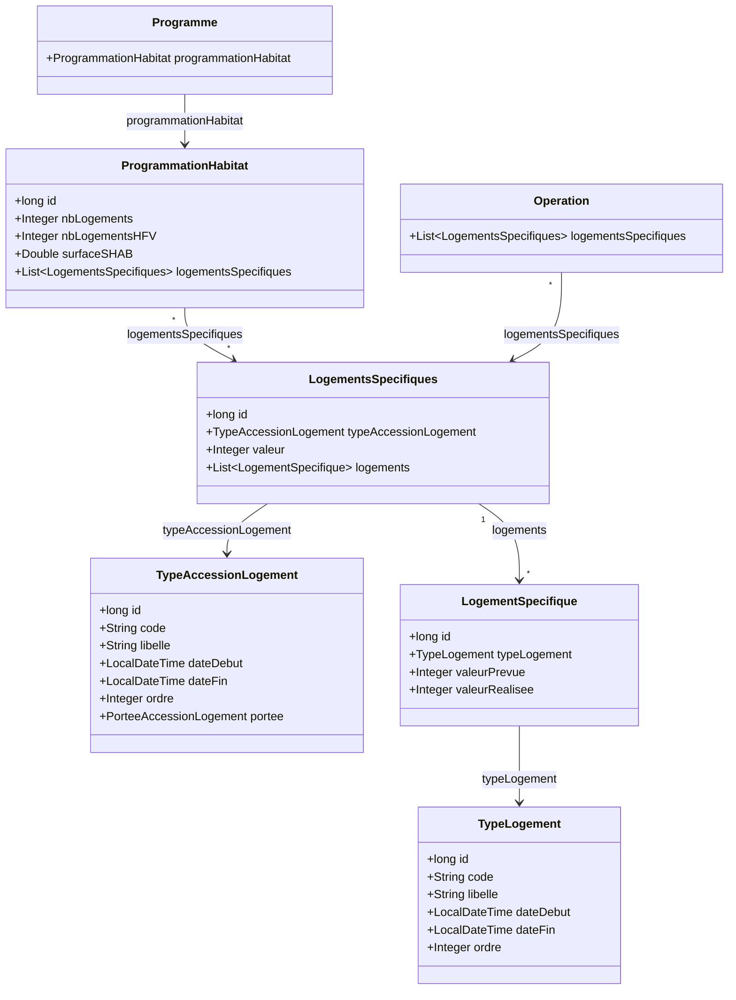

# Cadrage technique – Logements Spécifiques & Programmation Habitat

> Version cible : **2.3.0**

---

## 1. Contexte métier

Aujourd'hui, les données de programmation logement d'un **Programme** (nombre de logements par type d'accession : locatif aidé, accession aidée, etc.) sont stockées sous forme de colonnes figées dans l'entité `Programme`. Ce modèle pose deux problèmes :

- **Rigidité** : ajouter un nouveau type d'accession impose une modification du schéma de base, du code backend et du front.
- **Absence de logements spécifiques** : les 9 catégories de logements spécifiques (résidences étudiantes, sénior, jeunes actifs, béguinage, habitat participatif, etc.) ne sont pas modélisées et ne peuvent donc pas être suivies.

La demande se découpe en deux parties :

1. **Partie 1 – Programmation Habitat** : extraire les données logements du Programme dans une entité dédiée `ProgrammationHabitat`, et y rattacher les logements spécifiques via un modèle extensible (table de jointure + référentiels). Cela permet d'ajouter un type d'accession ou un type de logement spécifique par simple insertion en base, sans aucun changement de code.

2. **Partie 2 – Logements spécifiques sur l'Opération** : permettre de saisir des logements spécifiques directement au niveau de l'Opération (un seul groupe global, sans distinction par type d'accession).

### Règles métier clés

- Un **Programme** possède une seule `ProgrammationHabitat` qui porte le nombre total de logements, le nombre HFV et la surface SHAB, ainsi qu'une liste de groupes de logements spécifiques (un par type d'accession).
- Chaque groupe de logements spécifiques contient des lignes de détail (un par type de logement : total, résid. étudiante, etc.) avec des valeurs prévue et réalisée.
- Une **Opération** peut porter un unique groupe de logements spécifiques (sans passer par la programmation habitat).
- Les types d'accession et les types de logement sont des **référentiels** avec des dates de début/fin permettant de contrôler leur affichage côté front sans redéploiement.
- Le total des logements spécifiques n'est pas dénormalisé : il est représenté par la ligne de type `TOTAL` dans le détail, ce qui évite les incohérences.

---

## 2. Diagramme de classes (état cible)

> Le diagramme UML de classes est disponible au format Mermaid ci-dessous.

---

## 3. Nouvelles entités

### 3.1 `TypeAccessionLogement` *(référentiel)*

Représente les **catégories d'accession au logement** (locatif aidé, accession libre, etc.) qui étaient auparavant modélisées sous forme de colonnes dans `Programme`.

Chaque type d'accession est rattaché à une **portée** (`OPERATION`, `PROGRAMME` ou `SECTEUR`) qui indique à quel niveau de l'arborescence métier il s'applique. Les champs `dateDebut` / `dateFin` permettent d'activer ou désactiver un type sans modifier le code.

**Données initiales (portée PROGRAMME) :**

| Code | Libellé | Ordre |
|---|---|---|
| `LOCATIF_AIDE` | Locatif aidé | 1 |
| `ACCESS_AIDE` | Accession aidée | 2 |
| `LOCATIF_REG_PRIVE` | Locatif régulé privé | 3 |
| `LOCATIF_REG_HLM` | Locatif régulé HLM | 4 |
| `ACCESS_MAITRISE` | Accession maîtrisée | 5 |
| `ACCESS_LIBRE` | Accession libre | 6 |

> D'autres lignes seront ajoutées pour les portées `OPERATION` et `SECTEUR`.

---

### 3.2 `TypeLogement` *(référentiel)*

Les **9 types de logements spécifiques** identifiés dans le besoin métier. Le type `TOTAL` sert de ligne de totalisation dans l'affichage tabulaire.

| Code | Libellé | Ordre |
|---|---|---|
| `TOTAL` | Logts spécifiques (total) | 1 |
| `RESID_JEUNES_ACTIFS` | Résid. jeunes actifs | 2 |
| `RESID_ETUDIANTE` | Résid. étudiante | 3 |
| `RESID_SENIOR` | Résid. sénior | 4 |
| `HABITAT_PARTICIPATIF` | Habitat participatif | 5 |
| `RESID_CO_LIVING` | Résid. co-living | 6 |
| `ADAPTES_GDV` | Adaptés GDV | 7 |
| `BEGUINAGE` | Béguinage | 8 |
| `ADAPTES_INSERTION` | Adaptés d'insertion | 9 |

---

### 3.3 `LogementsSpecifiques`

Représente **un groupe de logements spécifiques pour un type d'accession donné** (ex : l'ensemble des logements spécifiques du « Locatif aidé »).

Cette entité est **réutilisable** : elle est rattachée aux Programmes (via `ProgrammationHabitat` et une table de jointure) et aux Opérations (via une FK directe).

Elle porte un champ `valeur` (entier, nullable) qui représente la valeur globale associée au groupe de logements spécifiques pour ce type d'accession.

**Attributs :**
- Référence vers un `TypeAccessionLogement`
- `valeur` (entier, nullable) : valeur associée au groupe
- Liste de `LogementSpecifique` (relation one-to-many, cascade complète avec suppression des orphelins)

---

### 3.4 `LogementSpecifique`

Représente **une ligne du tableau de détail** : un type de logement associé à ses valeurs prévue et réalisée.

**Attributs :**
- Référence vers un `TypeLogement`
- `valeurPrevue` (entier, nullable)
- `valeurRealisee` (entier, nullable)

---

### 3.5 `ProgrammationHabitat` *(Partie 1)*

Regroupe toutes les données **habitat** actuellement portées par `Programme`. Cette extraction permet d'isoler la programmation logement dans un objet dédié, plus facile à faire évoluer.

**Attributs :**
- `nbLogements` : nombre total de logements
- `nbLogementsHFV` : nombre de logements favorables au vieillissement
- `surfaceSHAB` : surface habitable totale

**Relation avec les logements spécifiques :**
Les groupes de logements spécifiques sont reliés via une **table de jointure** (`tabou_prog_habitat_logements_sp`), et non via des FK en dur. Cela signifie qu'ajouter un nouveau type d'accession se fait **uniquement par insertion en base**, sans aucune modification de code ni de schéma.

---

## 4. Migration SQL

Le script de migration est disponible dans le répertoire des scripts de migration :

📄 **[`resources/bdd/migration2.2.0Vers2.3.0.sql`](../bdd/migration2.2.0Vers2.3.0.sql)**

Ce script doit être joué lors du passage en version 2.3.0. Il contient :
- La création des nouvelles tables (référentiels, logements spécifiques, programmation habitat, table de jointure)
- La migration des données existantes de `Programme` vers `ProgrammationHabitat`
- L'ajout de la FK logements spécifiques sur `Operation`
- L'insertion des données référentielles (types d'accession et types de logement)
- La création des index

> ⚠ La correspondance programme ↔ programmation habitat lors de la migration est à valider selon les identifiants réels en production. Les `DROP COLUMN` sur `tabou_programme` sont commentés et ne doivent être joués qu'après validation complète de la migration.

---

## 5. Nouveaux points d'entrée API

### 5.1 `/types-accession-logement`

CRUD sur le référentiel des types d'accession au logement.

| Méthode | URL | Description |
|---|---|---|
| `GET` | `/types-accession-logement` | Recherche paginée des types d'accession |
| `GET` | `/types-accession-logement/{id}` | Récupération d'un type par son identifiant |
| `POST` | `/types-accession-logement` | Création d'un nouveau type d'accession |
| `PUT` | `/types-accession-logement/{id}` | Mise à jour d'un type existant |
| `PUT` | `/types-accession-logement/{id}/inactivate` | Inactivation d'un type (positionne `dateFin`) |

**Paramètres de recherche (`GET` liste) :**
- `libelle` – filtre par libellé (recherche partielle)
- `inactif` – inclure les éléments inactifs (défaut : `false`)
- `start`, `resultsNumber` – pagination
- `orderBy`, `asc` – tri (défaut : `ordre`, ascendant)

---

### 5.2 `/types-logement`

CRUD sur le référentiel des types de logement spécifique.

| Méthode | URL | Description |
|---|---|---|
| `GET` | `/types-logement` | Recherche paginée des types de logement |
| `GET` | `/types-logement/{id}` | Récupération d'un type par son identifiant |
| `POST` | `/types-logement` | Création d'un nouveau type de logement |
| `PUT` | `/types-logement/{id}` | Mise à jour d'un type existant |
| `PUT` | `/types-logement/{id}/inactivate` | Inactivation d'un type (positionne `dateFin`) |

**Paramètres de recherche (`GET` liste) :**
- `libelle` – filtre par libellé (recherche partielle)
- `inactif` – inclure les éléments inactifs (défaut : `false`)
- `start`, `resultsNumber` – pagination
- `orderBy`, `asc` – tri (défaut : `ordre`, ascendant)
